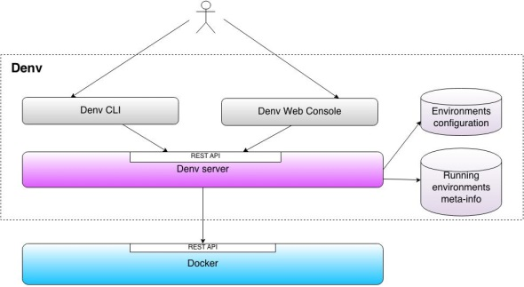

Denv  
====

Yet another manager for Docker based environments. See [why another one](https://github.com/ssouporg/denv/wiki/Rational).

Denv offers:

- A server daemon which talks to a Docker engine to manage multicontainer environments
- A way to store the configuration of environments, their versions, and the runtime info about running environments
- A way to manage the build of multiple versions of the same environment
- A way to run and monitor the state of multicontainer Docker environments
- A [Command Line Interface](https://github.com/ssouporg/denv/wiki/CLI-Commands)
- A [REST API](https://github.com/ssouporg/denv/wiki/REST-API)
- A Java Client library for easier interaction with the REST API
- A Web Console (planned)

For an introduction see the [Overview](https://github.com/ssouporg/denv/wiki) and the [Quick start](https://github.com/ssouporg/denv/wiki/Quick-start) pages or visit the [How to install](https://github.com/ssouporg/denv/wiki/How-to-install) section to start right away.

